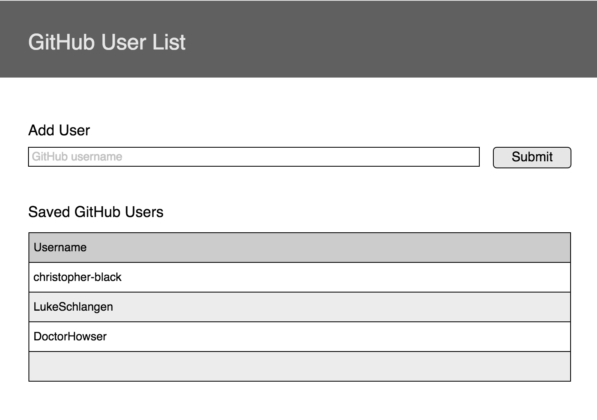
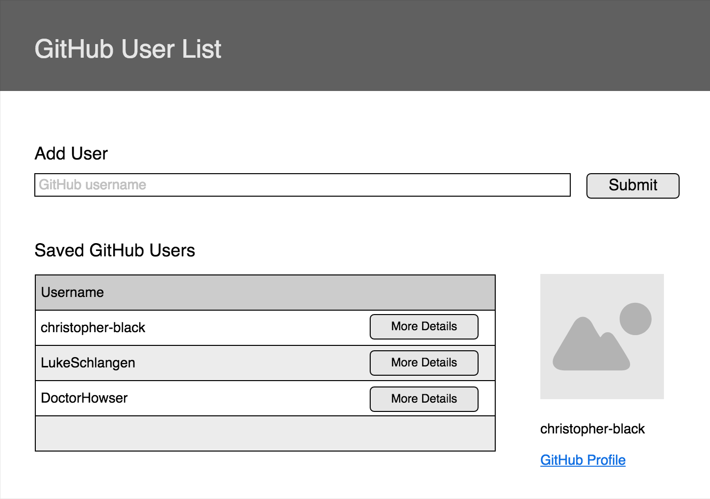

# REACT GITHUB STUDENT LIST

Before you get started make sure to look through the code that has been provided. Server side code to `GET` and `POST` a GitHub user has been proviced for you. There is also a form in a **component** (`components/StudentForm/StudentForm.js`) that passes data entered by the user back to `App.js`. You should not need to modify the StudentForm **component**.

### Setup

Start mongo if you haven't already with `mongod`. Running the server code requires `nodemon`. 

```
npm install
npm run server
npm run client
```

Between the server, client and mongo, you'll need three terminal tabs!

## BASE MODE

- Use `Axios` to submit save form data to the database by posting data to `/students`.
- Retrieve the user list and store it in the `App.js`. Create a new **component** called `StudentList.js` and pass it the data. 
- Display the students in a table on the DOM.
- Update the user list each time a new user is added to the database.

### Base Mode Wireframe



## HARD MODE

- Add a **More Details** button for each user. When the button is clicked on, pass the selected user back to `App.js`.
- Make a request to the GitHub API to retrieve more details about the user. Create a new **component** on the page that displays those details.
   - `https://api.github.com/users/GITHUB_USERNAME`
- Create a new **component** that renders each individual list item in the user list.

### Hard Mode Wireframe



## PRO MODE

- Add a button to **delete** a user from the list. This will require both UI changes and a new route.
- Add syling to your components.
- Repeat over the users followers and display them below the selected users profile information. 

No wireframe for pro mode.
